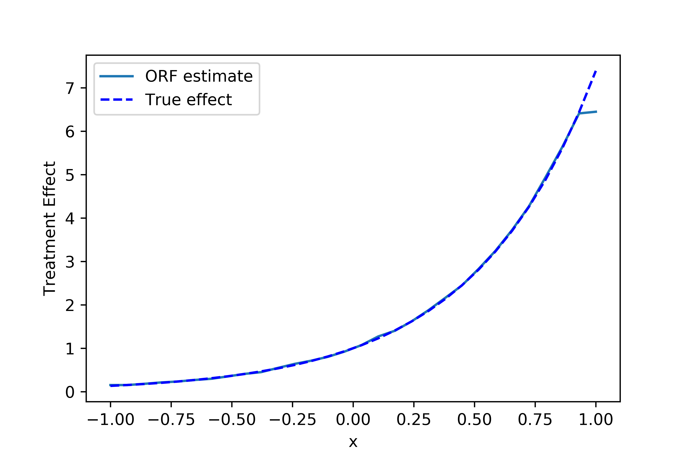

.. _orthoforestuserguide:

=======================
Forest Based Estimators
=======================

What is it?
==================================

This section describes the different estimation methods provided in the package that use a forest based methodology
to model the treatment effect heterogeneity. We collect these methods in a single user guide to better illustrate
their comparisons and differences. Currently, our package offers three such estimation methods:

* The Orthogonal Random Forest Estimator (see :class:`.ContinuousTreatmentOrthoForest`, :class:`.DiscreteTreatmentOrthoForest`)
* The Forest Double Machine Learning Estimator (aka Causal Forest) (see :class:`.ForestDML`)
* The Forest Doubly Robust Estimator (see :class:`.ForestDRLearner`).

These estimators, similar to the DML and DR sections require the unconfoundedness assumption, i.e. that all potential
variables that could simultaneously have affected the treatment and the outcome to be observed.

There many commonalities among these estimators. In particular the :class:`.ContinuousTreatmentOrthoForest` shares
many similarities with the :class:`.ForestDML` and the :class:`.DiscreteTreatmentOrthoForest` shares
many similarities with the :class:`.ForestDRLearner`. Specifically, the corresponding classes use the same estimating (moment)
equations to identify the heterogeneous treatment effect. However, they differ in a substantial manner in how they
estimate the first stage regression/classification (nuisance) models. In particular, the OrthoForest methods fit
local nuisance parameters around the target feature :math:`X` and so as to optimize a local mean squared error, putting
more weight on samples that look similar in the :math:`X` space. The similarity metric is captured by a data-adaptive
forest based method that tries to learn a metric in the :math:`X` space, such that similar points have similar treatment effects.
On the contrary the DML and DR forest methods perform a global first fit, which typically will optimize the overall
mean squared error. Local fitting can many times improve the final performance of the CATE estimate. However, it does
add some extra computational cost as a separate first stage model needs to be fitted for each target prediction point.
All these three methods provide valid confidence intervals as their estimates are asymptotically normal. Moreover,
the methods differ slightly in how they define the the similarity metric in finite samples, in that the OrthoForest
tries to grow a forest to define a similarity metric that internally performs nuisance estimation at the nodes
and uses the same metric for the local fitting of the nuisances as well as the final CATE estimate. See 
[Wager2018]_, [Athey2019]_, [Oprescu2019]_ for more technical details around these methods.

What are the relevant estimator classes?
========================================

This section describes the methodology implemented in the classes, :class:`.ContinuousTreatmentOrthoForest`,
:class:`.DiscreteTreatmentOrthoForest`,
:class:`.ForestDML`, :class:`.ForestDRLearner`.
Click on each of these links for a detailed module documentation and input parameters of each class.

When should you use it?
==================================

These methods estimate very flexible non-linear models of the heterogeneous treatment effect. Moreover, they
are data-adaptive methods and adapt to low dimensional latent structures of the data generating process. Hence,
they can perform well even with many features, even though they perform non-parametric estimation (which typically
requires a small number of features compared to the number of samples). Finally, these methods use recent ideas
in the literature so as to provide valid confidence intervals, despite being data-adaptive and non-parametric.
Thus you should use these methods if you have many features, you have no good idea how your effect heterogeneity
looks like and you want confidence intervals.

Overview of Formal Methodology
==================================

Orthogonal Random Forests
-------------------------

Orthogonal Random Forests [Oprescu2019]_ are a combination of causal forests and double machine learning that allow
for controlling for a high-dimensional set of confounders :math:`W`, while at the same time estimating non-parametrically
the heterogeneous treatment effect :math:`\theta(X)`, on a lower dimensional set of variables :math:`X`. 
Moreover, the estimates are asymptotically normal and hence have theoretical properties
that render bootstrap based confidence intervals asymptotically valid.

In the case of continuous treatments (see :class:`.ContinuousTreatmentOrthoForest`) the method estimates :math:`\theta(x)`
for some target :math:`x` by solving the same set of moment equations as the ones used in the Double Machine Learning
framework, albeit, it tries to solve them locally for every possible :math:`X=x`. The method makes the following
structural equations assumptions on the data generating process:

.. math::

    Y =~& \theta(X) \cdot T + g(X, W) + \epsilon ~~~&~~~ \E[\epsilon | X, W] = 0 \\ 
    T =~& f(X, W) + \eta & \E[\eta \mid X, W] = 0 \\
    ~& \E[\eta \cdot \epsilon | X, W] = 0

But makes no further strong assumption on the functions :math:`\theta, g, f`. It primarily assumes that :math:`\theta`
is a Lipschitz function. It identifies the function :math:`\theta` via the set of local moment conditions:

.. math::

    \E[\left( Y - \E[Y \mid X, W] - \theta(x)\cdot (T- \E[T \mid X, W]) \right)\cdot \left(T - \E[T \mid X, W]\right) \mid X=x]=0

Equivalently, if we let :math:`q(X, W)=\E[Y | X, W]`, then we can re-write the latter as:

.. math::

    \E[\left( Y - q(x, W) - \theta(x) \cdot (T- f(X, W)) \rangle \right)\cdot \left(T - f(X, W)\right) \mid X=x]=0

This is a local version of the DML loss, since the above is equivalent to minimizing the residual :math:`Y` on
residual :math:`T` square loss, locally at the point :math:`X=x`:

.. math::

    \theta(x) = \argmin_{\theta} \E[\left( Y - q(X, W) - \theta \cdot (T- f(X, W)) \right)^2 \mid X=x]

When taking these identification approach to estimation, we will replace the local moment equations with a locally
weighted empirical average and replace the function :math:`q(X, W)`, :math:`f(X, W)`, with local estimates
:math:`\hat{q}_x(X, W)`, :math:`\hat{f}_x(X, W)` of these conditional expectations (which would typically be locally in 
:math:`x` parametric/linear functions).

.. math::

    \sum_{i=1}^n K_x(X_i)\cdot \left( Y_i - \hat{q}_x(X_i, W_i) - \hat{\theta}(x) \cdot (T_i - \hat{f}_x(X_i, W_i)) \right)\cdot \left(T_i - \hat{f}_x(X_i, W_i)\right) = 0

or equivalently minimize the local square loss (i.e. run a local linear regression):

.. math::

    \hat{\theta}(x) = \argmin_{\theta} \sum_{i=1}^n K_x(X_i)\cdot \left( Y_i - \hat{q}_x(X_i, W_i) - \theta \cdot (T_i - \hat{f}_x(X_i, W_i)) \right)^2

In fact, in our package we also implement the local-linear correction proposed in [Friedberg2018]_, where instead
of fitting a constant :math:`\theta` locally, we fit a linear function of :math:`X` locally and regularize
the linear part, i.e.:

.. math::

    \hat{\alpha}, \hat{\beta} =~& \argmin_{\alpha, \beta} \sum_{i=1}^n K_x(X_i) \left( Y_i - \hat{q}_x(X_i, W_i) - (\beta\cdot X_i + \alpha) (T_i - \hat{f}_x(X_i, W_i)) \right)^2 + \lambda \|\beta\|_2^2\\
    \hat{\theta}(x) =~& \hat{\beta} \cdot x + \hat{\alpha}

The kernel :math:`K_x(X_i)` is a similarity metric that is calculated by building a random forest with a causal criterion. This 
criterion is a slight modification of the criterion used in generalized random forests [Athey2019]_ and 
causal forests [Wager2018]_, so as to incorporate residualization when calculating the score of each candidate
split.

Moreover, for every target point :math:`x` we will need to estimate the local nuisance functions
:math:`\hat{q}_x(X, W)`, :math:`\hat{f}_x(X, W)` of the functions :math:`q(X, W) = \E[Y | X, W]` and :math:`f(X, W)=\E[T | X, W]`.
The method splits the data and performs cross-fitting: i.e. fits the
conditional expectation models on the first half and predicts the quantities on the second half and vice versa. 
Subsequently estimates :math:`\theta(x)` on all the data.

In order to handle high-dimensional :math:`W`, the method estimates the conditional expectations also in a local manner
around each target :math:`x`. In particular, to estimate :math:`\hat{q}_x(X, W)`, :math:`\hat{f}_x(X, W)` for each target :math:`x`
it minimizes a weighted (penalized) loss :math:`\ell` (e.g. square loss or multinomial logistic loss):

.. math::

    \hat{q}_x = \argmin_{q_x \in Q} \sum_{i=1}^n K_x(X_i)\cdot \ell(Y_i, q_x(X_i, W_i)) + R(q_x)\\
    \hat{f}_x = \argmin_{f_x \in F} \sum_{i=1}^n K_x(X_i)\cdot \ell(T_i, f_x(X_i, W_i)) + R(f_x)

where :math:`Q, F` is some function spaces and :math:`R` is some regularizer. If the hypothesis space
is locally linear, i.e. :math:`h_x(X, W) = \langle \nu(x), [X; W] \rangle`, the regularizer is the 
:math:`\ell_1` norm of the coefficients :math:`\|\nu(x)\|_1` and the loss is either the square
loss or the logistic loss, then the method has provable guarantees of asymptotic normality,
assuming the true coefficients are relatively sparse (i.e. most of them are zero). The 
weights :math:`K(x, X_i)` are computed using the same Random Forest algorithm with 
a causal criterion as the one used to calculate the weights for the second stage 
estimation of :math:`\theta(x)` (albeit using a different half sample than the one used for 
the final stage estimation, in a cross-fitting manner).

Algorithmically, the nuisance estimation part of the method is implemented in a
flexible manner, not restricted to :math:`\ell_1` regularization, as follows: the user can define any class that
supports fit and predict. The fit function needs to also support sample weights, passed as a third argument. 
If it does not, then we provided a weighted model wrapper :class:`.WeightedModelWrapper` that
can wrap any class that supports fit and predict and enables sample weight functionality. Moreover, we provide
some extensions to the scikit-learn library that enable sample weights, such as the :class:`.WeightedLasso`.

    .. testcode:: intro
        :hide:

        from econml.ortho_forest import ContinuousTreatmentOrthoForest
        from econml.sklearn_extensions.linear_model import WeightedLasso

    .. doctest:: intro

        >>> est = ContinuousTreatmentOrthoForest(model_Y=WeightedLasso(), model_T=WeightedLasso())

In the case of discrete treatments (see :class:`.DiscreteTreatmentOrthoForest`) the
method estimates :math:`\theta(x)` for some target :math:`x` by solving a slightly different
set of equations, similar to the Doubly Robust Learner (see [Oprescu2019]_ for a theoretical exposition of why a different set of
estimating equations is used). In particular, suppose that the treatment :math:`T` takes
values in :math:`\{0, 1, \ldots, k\}`, then to estimate the treatment effect :math:`\theta_t(x)` of
treatment :math:`t` as compared to treatment :math:`0`, the method finds the solution to the
equation:

.. math::

    \E\left[ Y_{i,t}^{DR} - Y_{i,0}^{DR}- \theta_t(x) | X=x\right] = 0

where :math:`Y_{i,t}^{DR}` is a doubly robust based unbiased estimate of the counterfactual
outcome of sample :math:`i` had we treated it with treatment :math:`t`, i.e.:

.. math::

    Y_{i,t}^{DR} = \E[Y \mid T=t, X_i, W_i] + 1\{T_i=t\} \frac{Y_i - \E[Y \mid T=t, X_i, W_i]}{\E[1\{T=t\} \mid X_i, W_i]} 

Equivalently, we can express this as minimizing a local square loss:

.. math::
    \theta_t(x) = \argmin_{\theta_t} \E\left[(Y_{i,t}^{DR} - Y_{i,0}^{DR}- \theta_t)^2 | X=x\right]

Similar to the continuous treatment case, we transfer this identification strategy to estimation by minimizing
a locally weighted square loss, with a local linear correction:

.. math::
    \hat{\alpha}_t, \hat{\beta}_t =& \argmin_{\alpha_t, \beta_t} \sum_{i=1}^n K(x, X_i)\cdot \left( Y_{i,t}^{DR} - Y_{i,0}^{DR}- \beta_t\cdot X_i + \alpha_t \right)^2 + \lambda \|\beta_t\|_2^2\\
    \hat{\theta}_t(x) =& \hat{\beta}_t \cdot x + \hat{\alpha}_t

where we use first stage local estimates :math:`g_x(T, X, W)`, :math:`p_{x, t}(X, W)` of the conditional
expectations :math:`\E[Y \mid T=t, X, W]` and :math:`\E[1\{T=t\} \mid X, W]`, when constructing the doubly robust
estimates. These are estimated by fitting a locally-weighted regression and classification model, correspondingly,
in a cross-fitting manner. We note that in the case of discrete treatment, the model for the treatment is 
a multi-class classification model and should support :code:`predict_proba`.

For more details on the input parameters of the orthogonal forest classes and how to customize
the estimator checkout the two modules:

- :class:`.DiscreteTreatmentOrthoForest`
- :class:`.ContinuousTreatmentOrthoForest`

CausalForest (aka Forest Double Machine Learning)
--------------------------------------------------

In this package we implement the double machine learning version of Causal Forests/Generalized Random Forests (see [Wager2018]_, [Athey2019]_) 
as for instance described in Section 6.1.1 of [Athey2019]_. This version follows a similar structure to the ContinuousTreatmentOrthoForest approach,
in that the estimation is based on solving a local residual on residual moment condition:

.. math::

    \hat{\theta}(x) = \argmin_{\theta} \sum_{i=1}^n K_x(X_i)\cdot \left( Y_i - \hat{q}(X_i, W_i) - \theta \cdot (T_i - \hat{f}(X_i, W_i)) \right)^2

The similarity metric :math:`K_x(X_i)` is trained in a data-adaptive manner by constructing a Subsampled Honest Random Forest
with a causal criterion and roughly calculating how frequently sample :math:`x` falls in the same leaf as
sample :math:`X_i`.

The Causal Forest has two main differences from the OrthoForest: first the nuisance estimates :math:`\hat{q}` and :math:`\hat{f}`
are fitted based on a global objective and not locally for every target point. So typically they will not be minimizing
some form of local mean squared error. Second the similarity metric that was potentially used to fit these
estimates (e.g. if a RandomForest was used) is not coupled with the similarity metric used in the final effect estimation.
This difference can potentially lead to an improvement in the estimation error of the OrthoForest as opposed to the
Causal Forest. However, it does add significant computation cost, as a nuisance function needs to be estimated locally
for each target prediction.

Our implementation of a Causal Forest is restricted to binary treatment or single-dimensional continuous treatment
and is based on an extra observation that for such settings, we can view the local square loss above as a normal regression
square loss with sample weights, i.e.:

.. math::

    \hat{\theta}(x) = \argmin_{\theta} \sum_{i=1}^n K_x(X_i)\cdot \tilde{T}_i^2 \cdot \left( \tilde{Y}_i/\tilde{T}_i - \theta\right)^2

where :math:`\tilde{T}_i = T_i - \hat{f}(X_i, W_i)` and :math:`\tilde{Y}_i = Y_i - \hat{q}(X_i, W_i)`. Thus we can apply
a normal regression forest to estimate the :math:`\theta`. Albeit for valid confidence intervals we need a forest
that is based on subsampling and uses honesty to define the leaf estimates. Thus we can re-use the splitting machinery
of a scikit-learn regressor and augment it with honesty and subsampling capabilities. We implement this in our
:class:`.SubsampledHonestForest` scikit-learn extension.

The causal criterion that is implicit in the above reduction approach is slightly different than the one
proposed in [Athey2019]_. However, the exact criterion is not crucial for the theoretical developments and the
validity of the confidence intervals is maintained. The difference can potentially lead to small finite sample
differences. In particular, suppose that we want to decide how to split a node in two subsets of samples :math:`S_1`
and :math:`S_2` and let :math:`\theta_1` and :math:`\theta_2` be the estimates on each of these partitions.
Then the criterion implicit in the reduction is the weighted mean squared error, which boils down to

.. math::

    \max_{S_1, S_2} \theta_1^2 \sum_{i\in S_1} \tilde{T}_i^2 + \theta_2^2 \sum_{i \in S_2} \tilde{T}_i^2 \approx
    \max_{S_1, S_2} \theta_1^2 \cdot |S_1| \cdot Var_n(T | x\in S_1) + \theta_2^2 \cdot |S_2|\cdot Var_n(T | x \in S_2)

where :math:`Var_n`, denotes the empirical variance. Essentially, this criterion tries to maximize heterogeneity
(as captured by maximizing the sum of squares of the two estimates), while penalizing splits that create nodes
with small variation in the treatment. On the contrary the criterion proposed in [Athey2019]_ ignores the within
child variation of the treatment and solely maximizes the hetergoeneity, i.e. :math:`\max_{S_1, S_2} \theta_1^2 + \theta_2^2`.

Moreover, a subtle point is that in order to mirror the Genearlized Random Forest algorithm, our final prediction is not just
the average of the tree estimates. Instead we use the tree to define sample weights as describe in [Athey2019]_ and then
calculate the solution to the weighted moment equation or equivalently the minimizer of the square loss, which boils down to:

.. math::

    \hat{\theta}(x) = \frac{\sum_{i=1}^{n} K_x(X_i) \cdot \tilde{Y}_i \cdot \tilde{T}_i}{\sum_{i=1}^n K_x(X_i) \cdot \tilde{T}_i^2}

From our reduction prespective, this is equivalent to saying that we will train a regression forest with sample weights
:math:`k_i`, features :math:`X_i` and labels :math:`Y_i` and then in the end, we will define the overall estimate at some target :math:`x`, as:

.. math::

    \hat{\theta}(x) =~& \frac{\sum_{b=1}^B \sum_{i=1}^n w_{bi}\cdot Y_i}{\sum_{b=1}^B \sum_{i=1}^n w_{bi}}\\
    w_{bi} =~& \frac{k_i\cdot 1\{i \in L_{b}(x)\}}{|L_b(x)|}

where :math:`L_b(x)` is the leaf the sample :math:`x` falls into in the :math:`b`-th tree of the forest.
This is exactly what is implemented in the SubsampledHonestForest (see :class:`.SubsampledHonestForest`). Combining
these ideas leads to a "reduction-based" approach implementation of the Causal Forest, that re-uses and only slightly modifies
existing impementations of regression forests.

For more details on Double Machine Learning and how the :class:`.ForestDML` fits into our overall
set of DML based CATE estimators, check out the :ref:`Double Machine Learning User Guide <dmluserguide>`.

Forest Doubly Robust Learner
-------------------------------

The Forest Doubly Robust Learner is a variant of the Generalized Random Forest and the Orthogonal Random Forest
(see [Wager2018]_, [Athey2019]_, [Oprescu2019]_) that uses the doubly robust moments for estimation as opposed
to the double machine learning moments (see the :ref:`Doubly Robust Learning User Guide <druserguide>`).
The method only applies for categorical treatments.

Essentially, it is an analogue of the :class:`.DiscreteTreatmentOrthoForest`, that instead of local nuisance estimation
it conducts global nuisance estimation and does not couple the implicit similarity metric used for the nuisance
estimates, with the final stage similarity metric. 

More concretely, the method estimates the CATE associated with treatment :math:`t`, by solving a local regression:

.. math::

    \theta_t(x) = \argmin_{\theta_t} \sum_{i=1}^n K(x, X_i)\cdot \left( Y_{i,t}^{DR} - Y_{i,0}^{DR} - \theta_t \right)^2

where:

.. math::

    Y_{i,t}^{DR} = \hat{g}(t, X_i, W_i) + 1\{T_i=t\} \frac{Y_i - \hat{g}(t, X_i, W_i)}{\hat{p}_t(X_i, W_i)]} 

and :math:`\hat{g}(t, X, W)` is an estimate of :math:`\E[Y | T=t, X, W]` and :math:`\hat{p}_t(X, W)` is an
estimate of :math:`\Pr[T=t | X, W]`. These estimates are constructed in a first estimation phase in a cross fitting
manner (see e.g. :class:`._OrthoLearner` for more details on cross fitting).

The similarity metric :math:`K_x(X_i)` is trained in a data-adaptive manner by constructing a Subsampled Honest Random Regression Forest
where the target label is :math:`Y_{i, t}^{DR} - Y_{i, 0}^{DR}` and the features are :math:`X` and roughly calculating
how frequently sample :math:`x` falls in the same leaf as
sample :math:`X_i`. This is implemented in the SubsampledHonestForest (see :class:`.SubsampledHonestForest`).

Class Hierarchy Structure
=========================

.. inheritance-diagram:: econml.ortho_forest.ContinuousTreatmentOrthoForest econml.ortho_forest.DiscreteTreatmentOrthoForest econml.drlearner.ForestDRLearner econml.dml.ForestDML
        :parts: 1
        :private-bases:
        :top-classes: econml._ortho_learner._OrthoLearner, econml.ortho_forest.BaseOrthoForest, econml.cate_estimator.LinearCateEstimator

Usage Examples
==================================

Here is a simple example of how to call :class:`.ContinuousTreatmentOrthoForest`
and what the returned values correspond to in a simple data generating process.
For more examples check out our 
`OrthoForest Jupyter notebook <https://github.com/Microsoft/EconML/blob/master/notebooks/Orthogonal%20Random%20Forest%20Examples.ipynb>`_ 
and the `ForestLearners Jupyter notebook <https://github.com/microsoft/EconML/blob/master/notebooks/ForestLearners%20Basic%20Example.ipynb>`_ .

    .. testcode::

        import numpy as np
        import sklearn
        from econml.ortho_forest import ContinuousTreatmentOrthoForest, DiscreteTreatmentOrthoForest
        np.random.seed(123)

    >>> T = np.array([0, 1]*60)
    >>> W = np.array([0, 1, 1, 0]*30).reshape(-1, 1)
    >>> Y = (.2 * W[:, 0] + 1) * T + .5
    >>> est = ContinuousTreatmentOrthoForest(n_trees=1, max_depth=1, subsample_ratio=1,
    ...                                      model_T=sklearn.linear_model.LinearRegression(),
    ...                                      model_Y=sklearn.linear_model.LinearRegression())
    >>> est.fit(Y, T, X=W, W=W)
    <econml.ortho_forest.ContinuousTreatmentOrthoForest object at 0x...>
    >>> print(est.effect(W[:2]))
    [1.00...  1.19...]

Similarly, we can call :class:`.DiscreteTreatmentOrthoForest`:

    >>> T = np.array([0, 1]*60)
    >>> W = np.array([0, 1, 1, 0]*30).reshape(-1, 1)
    >>> Y = (.2 * W[:, 0] + 1) * T + .5
    >>> est = DiscreteTreatmentOrthoForest(n_trees=1, max_depth=1, subsample_ratio=1,
    ...                                    propensity_model=sklearn.linear_model.LogisticRegression(),
    ...                                    model_Y=sklearn.linear_model.LinearRegression())
    >>> est.fit(Y, T, X=W, W=W)
    <econml.ortho_forest.DiscreteTreatmentOrthoForest object at 0x...>
    >>> print(est.effect(W[:2]))
    [0.99...  1.35...]

Let's now look at a more involved example with a high-dimensional set of confounders :math:`W`
and with more realistic noisy data. In this case we can just use the default parameters
of the class, which specify the use of the :class:`~sklearn.linear_model.LassoCV` for 
both the treatment and the outcome regressions, in the case of continuous treatments.

    >>> from econml.ortho_forest import ContinuousTreatmentOrthoForest
    >>> from econml.ortho_forest import ContinuousTreatmentOrthoForest
    >>> from econml.sklearn_extensions.linear_model import WeightedLasso
    >>> import matplotlib.pyplot as plt
    >>> np.random.seed(123)
    >>> X = np.random.uniform(-1, 1, size=(4000, 1))
    >>> W = np.random.normal(size=(4000, 50))
    >>> support = np.random.choice(50, 4, replace=False)
    >>> T = np.dot(W[:, support], np.random.normal(size=4)) + np.random.normal(size=4000)
    >>> Y = np.exp(2*X[:, 0]) * T + np.dot(W[:, support], np.random.normal(size=4)) + .5
    >>> est = ContinuousTreatmentOrthoForest(n_trees=100,
    ...                                     max_depth=5,
    ...                                     model_Y=WeightedLasso(alpha=0.01),
    ...                                     model_T=WeightedLasso(alpha=0.01))
    >>> est.fit(Y, T, X=X, W=W)
    <econml.ortho_forest.ContinuousTreatmentOrthoForest object at 0x...>
    >>> X_test = np.linspace(-1, 1, 30).reshape(-1, 1)
    >>> treatment_effects = est.effect(X_test)
    >>> plt.plot(X_test[:, 0], treatment_effects, label='ORF estimate')
    [<matplotlib.lines.Line2D object at 0x...>]
    >>> plt.plot(X_test[:, 0], np.exp(2*X_test[:, 0]), 'b--', label='True effect')
    [<matplotlib.lines.Line2D object at 0x...>]
    >>> plt.legend()
    <matplotlib.legend.Legend object at 0x...>
    >>> plt.show(block=False)

    Synthetic data estimation with high dimensional controls

