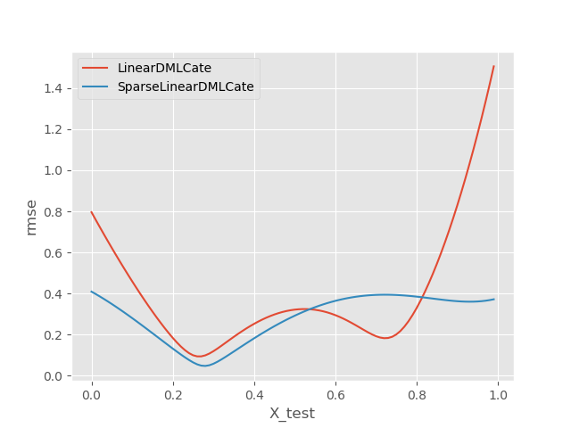
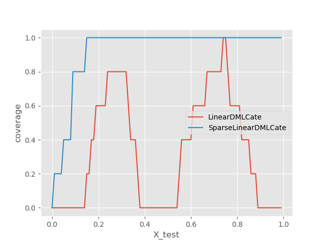
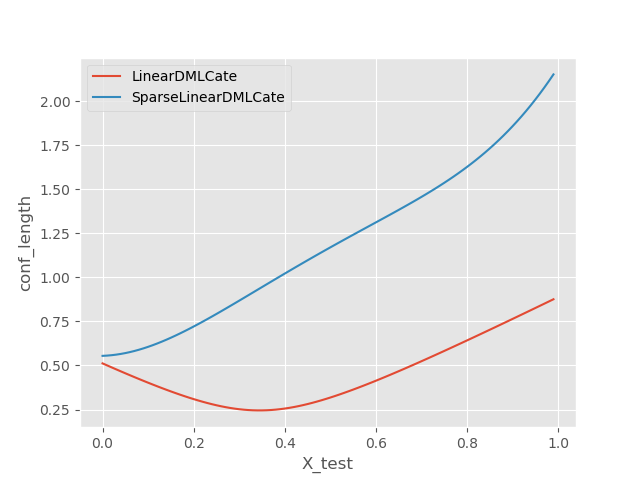
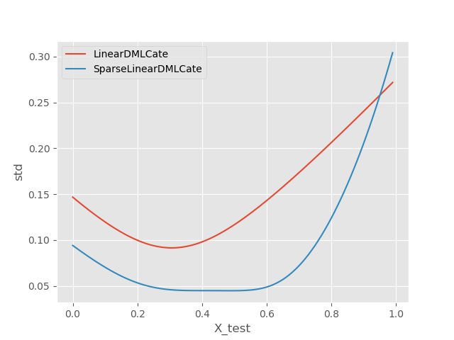
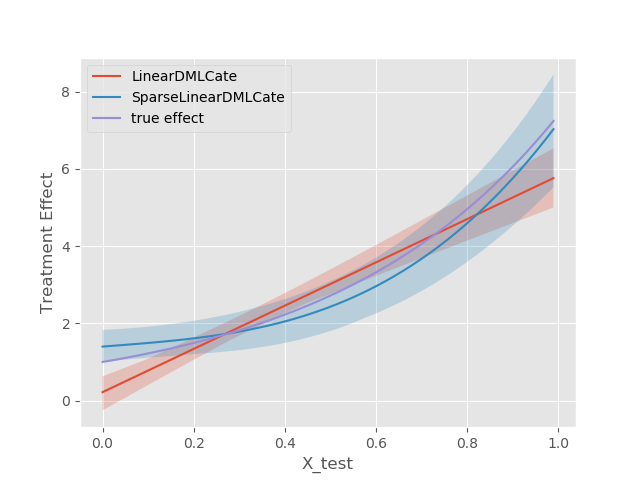
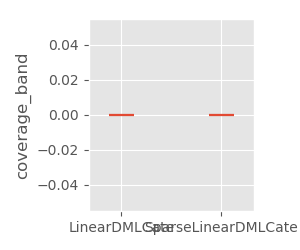

<!-- Copyright (c) Microsoft Corporation. All rights reserved. -->
<!-- Licensed under the MIT License. -->

# Monte Carlo Library
The folder mcpy contains code related to running monte carlo experiments from config files and saving and running the results.
Look at dml_te_confi.py and dml_te_functions.py as an example.

We can run a monte carlo simulation with the following from the command line:
```
python3 run_mc_from_config.py --config dml_te_config
```

The config dictionary allows one to run monte carlo experiments for some configuration of the parameters of the dgp, estimation methods, metrics, and plot functions. The MonteCarlo class will run experiments for each dgp, for each method, and on those results of each of those, calculate metrics and plots. DGPs, estimation methods, metrics, and plot functions can all be user defined. Thus this is a general framework to make monte carlo simulations easy to automate.  

The config looks like the following:
```python
CONFIG = {
  # whether to do a simulation for a fixed set of parameters vs. 'sweep_parameter',
  # where it will run multiple simulations for all permutations of the parameters
  "type" : 'single_parameter,
  # references to dgp functions
  "dgps" : {
    'dgp1': dml_te_functions.instance_params
  },
  # dgp options for each dgp
  "dgp_opts" : {
    'dgp1': {
        'n_samples': 2000,
        'n_features': 1,
        'n_controls': 30,
        'support_size': 5
      },
  },
  # references to methods
  "methods" : {

  },
  # method options, for each method
  "method_opts" : {
    "method1": {
      "LinearDMLCate": dml_te_functions.linear_dml_fit,
    },
    "method2": {

    }
  },
  # references to metric functions
  "metrics" : {
    'rmse': metrics.rmse,
    'conf_length': metrics.conf_length,
    'coverage': metrics.coverage,
    'std': metrics.std,
    'coverage_band': metrics.coverage_band
  },
  # references to plot functions
  "plots" : {
    'plot1': plotting.plot_metrics,
    'plot2': plotting.plot_visualization,
    'plot3': plotting.plot_violin
  },
  # different metrics are plotted differently
  # single summary metrics are single value per dgp and method
  "single_summary_metrics" : ['coverage_band'], # list of the metrics that are single summary metrics
  # plot to run for when the type is sweep_parameter.
  "sweep_plots" :{
  },
  # monte carlo simulation options
  "mc_opts" : {
    'n_experiments': 5, # number of monte carlo experiments
    "seed": 123
  },
  # comparison method reference # not supported currently
  "proposed_method" : {
  },
  # directory to save things to
  "target_dir" : "",
  "reload_results" : False # to rerun or load previous results
}
```

# Some Next Steps

- Use cloud computing service to run all simulations with a lot of cores, in parallel, on the cloud. This will yield better simulation results and allow us to run simulations over many more parameters and better evaluate the empirical performance of the estimators.
- A lot of HTE are calculated for some treatment T0 to T1. When evaluating the performance, the user should perhaps specify those specific vectors on their own in the dgp amd method functions that they write, or perhaps they should also be swept over in the MonteCarloSweep. A question is for how to sweep over different values for them, e.g, in what increments, especially as they get to be high dimensional.
- Construct more dgps, and look at more real data sets to perform simulations on
- Integrate this with the rest of the code suite such that whenever significant updates to the implementations of the estimators are made, a host of MC simulations are run and the results are compared to previous ones before the implementation changes. This would allow us to understand the change in empirical performance of the estimators after the change in implementation.
- More metrics and plotting functions, try to generalize them and not have them specific to specific DGP/method/ implementations.  
- Overall challenge of how to keep the framework general and but also be able to define nitty-gritty DGPs/methods/metrics/plots. Return types that are more vague like lists or tuples or dictionaries may allow for lots of different DGP/method implementations that use the framework at the same time, where each of those is specified in the references from the config file. Best way to realize what small adjustments to make is to implement a bunch of DGPs/methods/metrics/plots and see what return types need to be made more general or more specific/tailored. For example, when X_test is multidimensional there's an issue for how to plot the metrics. Do you plot them with respect to the first column or X_test? or? This means we may have to make the plot functions specific to that DGP/method set up. The framework allows for anyone to write their own dgps/methods/metrics/plot functions, but achieving more generality would be preferable. Maybe for sets/classes of certain DGPs that are used in testing a lot together. Anything to avoid lots of specific code for each dgp/etc., otherwise the test codebase will get big.

# Example Plots
<p align="center">
  
  
  
  
  
  
  <br/>
  <i>Example plots for DGP in dml_te_config.py</i>
</p>
